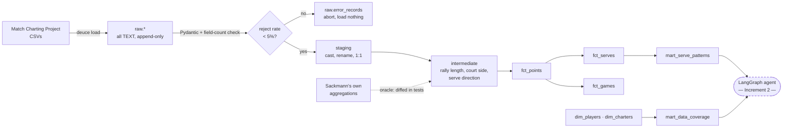

# Deuce

**Tactical tennis questions, answered from shot-by-shot data — with the rows the
answer came from.**

*Deuce: the tied state where the next point decides everything. This project is
about what players give away when it does.*

> *"On second-serve points at 30–40, where does Alcaraz serve — and how
> predictable is it?"*

A box score says he won 68% of second-serve points. It cannot say that he leans
wide on the ad court, or that he nets 45% of his break-point faults and 40% of
the rest. That gap — between *what happened* and *what the pattern was* — is
what this closes.

---

## Status

| Increment | Ships | State |
|---|---|---|
| **0** | Repo, Postgres ingest, one question answered end-to-end | ✅ done |
| **1** | dbt spine + Dagster orchestration + tests | ✅ done |
| **2** | LangGraph text-to-SQL agent; every answer cites its source rows | ⚪ next |
| **3** | Eval harness + pgvector similarity + Langfuse tracing | ⚪ |
| **4** | MCP server exposing the analytics as tools | ⚪ |

**The warehouse is built; the agent is not.** Everything below was produced by
SQL against these marts, not by an LLM. Nothing here is claimed until it runs —
`dbt build` runs 14 models and 43 tests green; `pytest` 31.

```
 11,819 matches   1,875,132 points   2,577,836 serves   296,286 games   1,739 players
```

---

## What it found

The point of a warehouse is the answers. These are real, and each is
reproducible from a single query.

### Momentum is a rally-length effect, not psychology

*"After winning a long rally, do you win the next point more often?"* The naive
query says yes. Hold the server constant — consecutive points inside the same
game — and split by who won the previous point:

```
       control        |    previous point     |    n    | same player wins next
----------------------+-----------------------+---------+-----------------------
 returner won prev pt | after short pt (<=4)  | 320,823 |        0.3949
 returner won prev pt | after LONG rally (9+) |  63,575 |        0.4046   +1.0pp
 server won prev pt   | after short pt (<=4)  | 473,757 |        0.6299
 server won prev pt   | after LONG rally (9+) |  78,681 |        0.6099   −2.0pp
```

**The halves move in opposite directions.** Momentum would help whoever just
won. What's actually happening: a long rally predicts the next point is also
contestable, and contestable points favour the returner. The effect people call
momentum is rally length wearing a costume.

### Players have serve tells, and they're individual

Ad-court first serves, break point vs. everything else:

```
 Medvedev   body 4.5%  ← effectively a two-option server
 Djokovic   entropy 0.840 → 0.859 on break point   (harder to read)
 Federer    entropy 0.782 → 0.765                  (easier to read)
```

There is **no tour-wide tendency** — predictability under pressure is a player
property, which makes it a scouting feature rather than a rule.

### How a player misses is a tell too

Fault direction is one character in the notation, and nobody publishes it sliced
by pressure:

```
 first-serve faults, ad court    net    deep   wide   first-serve %
 Alcaraz    break point         0.449  0.313  0.187      0.629
 Alcaraz    neutral             0.398  0.392  0.172      0.661
 Medvedev   break point         0.371  0.379  0.171      0.603
 Medvedev   neutral             0.408  0.404  0.140      0.623
```

Alcaraz nets **more** on break point and his first-serve percentage drops —
decelerating. Medvedev nets **less** — swinging through it.

### Sanity: the numbers match the real tours

Hold rate **80.2%** on the men's side, **66.5%** on the women's. Both are the
actual figures. That check is worth more than "the code ran."

More in [`lessons/hypotheses-tennis.md`](lessons/hypotheses-tennis.md), including
the ones that **didn't** survive — and
[`docs/data-trust.md`](docs/data-trust.md) for what each number is worth.

---

## The two layers

**Layer 1 — the data engineering spine.** The Match Charting Project publishes
shot-by-shot notation for thousands of matches, as CSVs where an entire rally is
one opaque string (`4b37y1r3n#`). Turning that into a tested, orchestrated,
queryable warehouse is most of the work.

**Layer 2 — the agent.** A LangGraph agent turning English into SQL against
those marts, disclosing its sample size and confidence tier, and refusing what
the data can't support. An eval harness scores it so "it got better" is a
measurement.



Dagster orchestrates ingest and `dbt build` as software-defined assets, with
date-partitioned backfill for the points files.

### The signature metric

**`serve_direction_entropy`** — `-Σ p·ln(p)` over wide/body/T, normalised to
`[0,1]`. `1.0` is a perfectly even split: unreadable. `0.0` is every serve to
the same spot.

Precomputed in `mart_serve_patterns` rather than left to the agent, because
entropy takes three passes and a zero-guard, and that's exactly the kind of SQL
an LLM gets subtly wrong.

---

## Quickstart

Requires Docker and [uv](https://docs.astral.sh/uv/).

```bash
make setup          # venv on Python 3.12 (dbt/dagster don't support 3.13 yet)
make up             # Postgres 16 + pgvector on :5433
make db-init        # schemas, extensions, raw tables

make ingest         # matches + serve stats (~30s)
make demo PLAYER="Carlos Alcaraz"
```

```
 court_side  direction  serves   share   serve_direction_entropy  matches_charted
 deuce       wide        3595   0.3871          0.9800                  221
 deuce       T           3487   0.3754          0.9800                  221
 deuce       body        2206   0.2375          0.9800                  221
 ad          wide        4424   0.5289          0.9225                  221
 ad          T           2243   0.2682          0.9225                  221
 ad          body        1697   0.2029          0.9225                  221
```

On the deuce court Alcaraz is near-unreadable — 0.98, an almost even three-way
split. On the ad court he tips his hand: **53% wide**, entropy 0.92. If you're
returning in the ad court, you cheat left.

Then the full warehouse:

```bash
make ingest-points    # 178 MB, ~1.9M points, ~60s
make ingest-oracles   # Sackmann's aggregations — ground truth for the parser
make dbt-build        # 14 models, 43 tests
make dagster          # asset graph and run history at :3000
```

---

## Layout

```
src/deuce/
  cli.py                  the `deuce` command
  ingest/                 SourceSpec per CSV · Pydantic validation · loader
  orchestration/          Dagster assets, schedules, asset checks
  agent/prompts.py        routing + grounding prompt        (Increment 2)

dbt/models/
  staging/                1:1 with raw — cast, rename, nothing else
  intermediate/           rally length, court side, charting flags
  marts/                  fct_points · fct_serves · fct_games
                          dim_players · dim_charters
                          mart_serve_patterns · mart_data_coverage
                          fct_shots (stub — needs the tokenizer)
dbt/tests/                oracle agreement · fact-vs-aggregate drift · index existence

sql/
  00N_*.sql               forward-only migrations
  investigations/         measurement harnesses; one CTE is the hypothesis

docs/
  data-trust.md           what every fact is worth, and what it isn't
  mcp-notation.md         the shot-notation codebook + measured accuracy
  marts.md                the grain ladder and the mart map
  schema.md               live schema, ER diagrams, normalisation reasoning
lessons/                  why it's built this way — plus a hypothesis log and
                          an error log, including the refuted and the wrong
notes/                    concept reference and writing backlog
questions.yml             16 questions: demo script, mart spec, eval set
```

---

## Design notes

**The raw layer is all `TEXT`.** Its job is fidelity, not correctness. When
upstream shipped a row with two fields missing, it *loaded* — and the breakage
surfaced in dbt staging with the offending value named, instead of dying
anonymously mid-`COPY`. Marts are rebuildable from raw; raw is the rollback
point.

**Field counts are checked before field values.** 11 upstream rows are missing
both player-name fields, which shifts every value one column left — handedness
lands in `Player 1`, the charter's name lands in `Best of`. Every value is
individually plausible, so no per-field validator can see it. Only the
arithmetic can.

**Ingest is idempotent and has a circuit breaker.** Rows stream through a temp
table and land with `ON CONFLICT DO UPDATE` on the natural key. The rejection
rate is checked *before* anything reaches the real table, so a bad file writes
nothing rather than half-loading.

**The parser is validated against an independent implementation.** Sackmann
publishes his own aggregations of the same strings, which makes them ground
truth — no labelling required. Rally length agrees on **90.0%** of 2020s
matches, 82.5% of 2010s, 55.2% of pre-2010, and `dbt build` fails if any tier
regresses below its baseline.

That spread is itself the finding. **Charting conventions drifted**, so every
parsed row carries `parse_confidence` and the agent must disclose it rather than
compare across eras silently.

**Counting questions don't need a parser; identity questions do.** Rally length
is one `regexp_replace` and it ties a 743-line typed parser at 90.0% vs 89.9%.
Anything naming a *specific* shot needs ordered records — shots alternate, so
position is the only attribution, and crosscourt-vs-down-the-line depends on
where the previous ball went. That's why `fct_shots` is at shot grain, and why
it's still a stub.

**Indexes are measured, not guessed.** A typical agent query seq-scanned 706 MB
for 7 rows. The most selective *column* gave 1.3×; a partial index on a *less*
selective boolean gave 200×, because heap fetches dominate. They live in model
config and a test asserts they exist — an index is state dbt doesn't consider
part of a model's contract.

---

## The questions

[`questions.yml`](questions.yml) holds 16, each doing triple duty: demo prompt,
mart spec, and eval case with reference SQL and grounding requirements.

- Where does *[player]* serve on second-serve points at 30–40, and how
  predictable is it?
- Each player's win rate by rally length (0–4, 5–8, 9+ shots).
- How often does *[player]* go down-the-line off the backhand — and is it +EV,
  or a highlight-reel trap with as many errors as winners?
- After winning a long rally, does a player win the next point more often — or
  is momentum a myth?
- If I'm about to play *[player]*: their three most predictable patterns, and
  where they're exploitable.

---

## Data

Match data from the [Match Charting Project](https://github.com/JeffSackmann/tennis_MatchChartingProject)
by Jeff Sackmann and hundreds of volunteer charters, **CC BY-NC-SA 4.0** — see
[ATTRIBUTION.md](ATTRIBUTION.md). Code is MIT.

No match data is committed here; `make ingest` fetches it from the source.

---

## Stack

PostgreSQL 16 · pgvector · dbt · Dagster · psycopg3 · Pydantic · Typer
· LangGraph, Langfuse, Ollama *(Increment 2+)*
