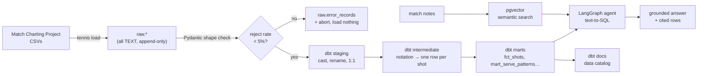

# Tennis Analytics Agent

**Ask tactical tennis questions in plain English. Get answers grounded in
shot-by-shot data, with the rows they came from.**

> *"On second-serve points at 30–40, where does Alcaraz serve — and how
> predictable is it?"*

Box scores can tell you he won 68% of second-serve points. They cannot tell you
that he goes to the body on break point and that it is readable. That gap — between
*what happened* and *what the pattern was* — is what this project closes.

---

## Status

| Increment | Ships | State |
|---|---|---|
| **0** | Repo, Postgres ingest, one real question answered end-to-end | 🟢 in progress |
| **1** | dbt spine (staging → intermediate → marts) + Dagster + tests | 🟢 done |
| **2** | LangGraph text-to-SQL agent; every answer cites its source rows | ⚪ |
| **3** | Eval harness (measured accuracy) + pgvector semantic search + Langfuse tracing | ⚪ |
| **4** | MCP server exposing the analytics as tools | ⚪ |

Built in public, one increment a week. Nothing above is claimed until it runs.

---

## The two layers

This is one repo doing two jobs, stacked.

**Layer 1 — the data engineering spine.** Jeff Sackmann's Match Charting Project
publishes shot-by-shot notation for thousands of professional matches: every serve
placement, every shot type, every direction, every error. It arrives as CSVs where
an entire rally is one opaque string (`4b37y1r3n#`). Turning that into a queryable
warehouse — ingest → raw → staging → marts, with tests, lineage and a catalog — is
most of the work and all of the foundation.

**Layer 2 — the agent.** A LangGraph agent that turns an English question into SQL
against those marts, routes the questions SQL *can't* answer to semantic search over
match notes, and refuses the ones the data doesn't support. Every answer carries its
sample size and its source matches. An eval harness scores it against a fixed
question set so "it got better" is a measurement, not a feeling.

### Architecture



### The signature metric

**`serve_direction_entropy`** — an information-theory measure of how unpredictable
a player's serve is. `-Σ p·ln(p)` over wide/body/T, normalised to `[0,1]`.

`1.0` means perfectly balanced and unreadable. `0.0` means every serve to the same
spot. Slice it by pressure and you get a scouting report: *this player has an
entropy of 0.94 on 30-0 and 0.41 on break point.* That is a thing you can take onto
a court.

It ships in Increment 0 — see `sql/queries/serve_direction_entropy.sql`.

---

## Quickstart

Requires Docker and [uv](https://docs.astral.sh/uv/).

```bash
make setup      # venv on Python 3.12 + deps (dbt/dagster don't support 3.13 yet)
make up         # Postgres 16 + pgvector on :5433
make db-init    # schemas, extensions, raw tables

make ingest     # matches + serve-direction stats (~30s)
make status     # row counts, ingest funnel, dead-letter count

make demo PLAYER="Carlos Alcaraz"
```

```
        court_side           direction              serves               share  serve_direction_entropy     matches_charted
             deuce                wide                3595              0.3871              0.9800                 221
             deuce                   T                3487              0.3754              0.9800                 221
             deuce                body                2206              0.2375              0.9800                 221
                ad                wide                4424              0.5289              0.9225                 221
                ad                   T                2243              0.2682              0.9225                 221
                ad                body                1697              0.2029              0.9225                 221
```

Read that as a scouting note: on the deuce court Alcaraz is close to unreadable
(0.98 — an almost even three-way split). On the ad court he tips his hand: **53%
of his serves go wide**, and entropy drops to 0.92. If you're returning in the ad
court, you cheat left. Across 221 charted matches.

That is the shape of every answer this project is built to produce.

Then the shot-level data, and the ground truth to check your parsing against:

```bash
make ingest-points    # 178 MB, ~1.9M charted points, ~60s
make ingest-oracles   # Sackmann's own aggregations -- see 'Design notes'
make dbt-build        # staging + intermediate + marts, 56 tests
make dagster          # asset graph + run history at localhost:3000
```

---

## What's in here

```
sql/                      raw DDL + the Increment 0 demo query
  001_schemas.sql           extensions (pgvector, pg_trgm), schemas
  002_raw_tables.sql        raw landing tables — all TEXT, by design
  003_observability.sql     ingest_runs + error_records (dead letter)
  queries/                  hand-written SQL that predates the marts

src/tennis_analytics/
  config.py                 settings, one source of truth
  db.py                     psycopg3 + idempotent migrations
  cli.py                    the `tennis` command
  ingest/
    sources.py              one SourceSpec per upstream CSV
    schemas.py              Pydantic shape validation
    loader.py               download → validate → stage → upsert
  agent/
    prompts.py              routing + grounding prompt (Increment 2)

dbt/
  models/staging/           1:1 with raw: cast, rename, nothing else
  models/intermediate/      business logic, joins, the notation parser
  models/marts/             what the agent queries

docs/mcp-notation.md      the shot-notation codebook + measured accuracy
docs/marts.md             what the warehouse exposes, at what grain, and why
docs/schema.md            live schema, layer diagrams, and the relational-theory
                          reasoning (why raw breaks 1NF and marts break 3NF)
lessons/                  why the repo is built this way: decisions, trade-offs,
                          a hypothesis log and an error log
questions.yml             16 questions: demo script, mart spec, and eval set
```

---

## Design notes

A few choices that are load-bearing, and why.

**The raw layer is all `TEXT`.** Its job is fidelity, not correctness. If upstream
starts writing `N/A` into a numeric field, ingest keeps working and the breakage
surfaces in dbt staging — visible, tested, and cheap to fix — instead of silently
eating rows at load time. Marts are always rebuildable from raw; raw is the
rollback point.

**Ingest is idempotent and transactional.** Rows stream into a temp table via
`COPY`, get checked, and land with `INSERT … ON CONFLICT DO UPDATE` on the natural
key. Run it twice, get the same table. If more than 5% of rows fail validation the
run aborts having written *nothing* — a schema change upstream shouldn't half-load
a file.

**Bad rows are kept, not dropped.** `raw.error_records` holds the payload and the
reason. A rejection rate is a metric you can trend; a rejected row is something you
can replay after fixing the parser.

**Field counts are checked before field values.** 11 rows in the upstream matches
files are missing both player-name fields, which shifts every remaining value one
column left — a player's *handedness* lands in `Player 1`, the charter's name lands
in `Best of`. Every one of those values is individually plausible, so no per-field
validator can see it; only the arithmetic can. They go to the dead-letter table with
the reason `columns are shifted`.

**pgvector lives in the same Postgres as the warehouse.** One fewer moving part,
and semantic search results can `JOIN` straight back onto the marts — a hit on a
match note can be enriched with that match's actual numbers in the same query.
(Qdrant is the swap-in if this ever needed to scale past one box.)

**The parser is validated against an independent implementation.** Sackmann
publishes his own aggregations of the same notation strings, which makes them ground
truth for our parsing — no labelling required. Rally length currently agrees with
his numbers on **90.0%** of 2020s matches, 82.5% of 2010s and 55.2% of pre-2010,
and `dbt build` fails if any tier regresses below its baseline.

That spread is itself the finding: **charting conventions drifted over the project's
history**, so every parsed row carries a `parse_confidence` column and the agent is
expected to disclose it rather than compare across eras silently.

---

## The questions

`questions.yml` holds 16 tennis questions. Each one does triple duty: a demo prompt,
a spec for a dbt mart, and an eval case with reference SQL and grounding
requirements. A sample:

- Where does *[player]* serve on second-serve points at 30–40, and how predictable is it?
- After a wide serve on the deuce court, how often is the next shot a forehand into
  the open court — and does it win the point?
- Each player's win rate by rally length (0–4, 5–8, 9+ shots).
- How often does *[player]* go down-the-line off the backhand — and is it +EV, or a
  highlight-reel trap with as many errors as winners?
- After winning a long rally, does a player win the next point more often, or is
  momentum a myth?
- If I'm about to play *[player]*: their three most predictable patterns, and where
  they're exploitable.

---

## Data

Match data from the [Match Charting Project](https://github.com/JeffSackmann/tennis_MatchChartingProject)
by Jeff Sackmann and hundreds of volunteer charters, licensed **CC BY-NC-SA 4.0**.
See [ATTRIBUTION.md](ATTRIBUTION.md). Code in this repo is MIT.

No match data is committed here — `make ingest` fetches it from the source.

---

## Stack

PostgreSQL 16 · pgvector · dbt · Dagster · LangGraph · Langfuse · Ollama · psycopg3 · Pydantic
