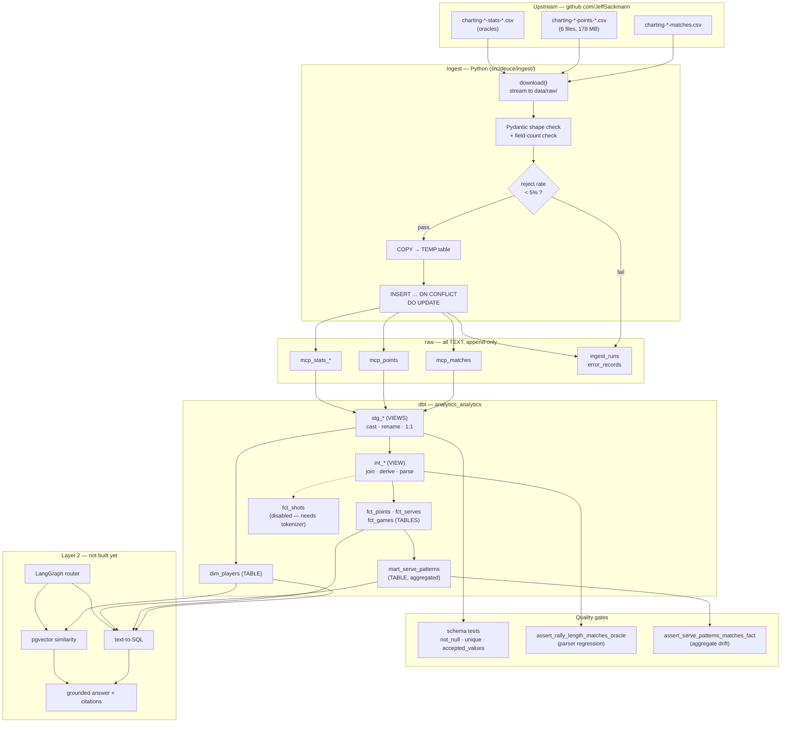
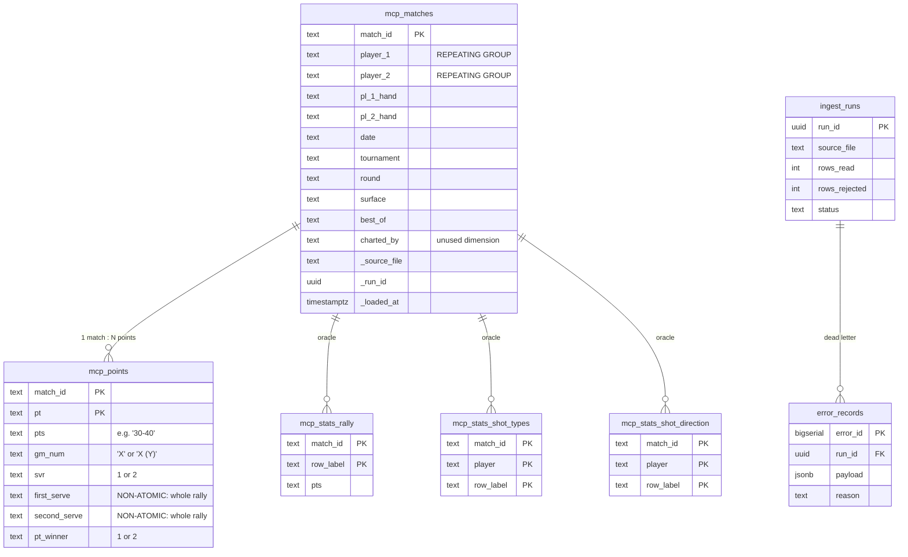
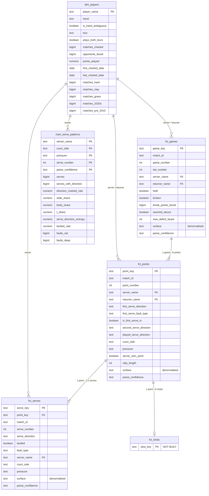

# Database schema

What's physically in Postgres, how the layers connect, and the relational-theory
reasoning behind the shape. Current as of the `fct_points` rename
(commit `2909558`).

`docs/marts.md` is the *plan*. This is the *state*.

---

## 1. Physical layout

Three schemas, one database. `pgvector` and `pg_trgm` are installed.

| Schema | Holds | Materialisation |
|---|---|---|
| `raw` | landed CSVs, all `TEXT`, + ingest observability | tables |
| `analytics_analytics` | dbt output — staging, intermediate, marts | views + tables |
| `analytics` | reserved; dbt's `+schema: analytics` concatenates onto the target schema, hence the doubled name | — |

Live sizes:

| Object | Kind | Rows | Size |
|---|---|---:|---:|
| `fct_serves` | table | 2,578,594 | 706 MB |
| `raw.mcp_points` | table | 1,875,004 | 563 MB |
| `fct_points` | table | 1,874,950 | 500 MB |
| `raw.mcp_stats_shot_types` | table | 537,695 | 163 MB |
| `fct_games` | table | 296,286 | 77 MB |
| `raw.mcp_stats_rally` | table | 151,226 | 46 MB |
| `raw.mcp_stats_shot_direction` | table | 93,388 | 29 MB |
| `raw.mcp_stats_serve_direction` | table | 70,799 | 23 MB |
| `mart_serve_patterns` | table | 29,294 | 6.7 MB |
| `raw.mcp_matches` | table | 11,819 | 4.0 MB |
| `dim_players` | table | 1,739 | 576 kB |
| `raw.error_records` | table | 22 | 80 kB |
| `raw.ingest_runs` | table | 20 | 32 kB |
| `stg_*`, `int_*` | **views** | — | 0 (virtual) |

---

## 2. How the layers connect



**The layer contract**, and why each boundary exists:

| Boundary | Rule | Enforced by |
|---|---|---|
| CSV → `raw` | no casting, no dropping, no renaming beyond snake_case | `tests/test_sources.py` |
| `raw` → `stg_` | cast, rename, 1:1 row mapping. No joins, no aggregation | review + `dbt_utils.unique_combination_of_columns` |
| `stg_` → `int_` | joins and derivations. No aggregation | review |
| `int_` → `fct_`/`mart_` | aggregation and denormalisation. What the agent queries | schema tests |
| oracles → tests only | an oracle may not feed the mart whose parser it validates | review (`docs/marts.md` §6) |

---

## 3. Raw layer — and three deliberate 1NF violations



If you've taken a DBMS course, `raw` will look wrong. It is, on purpose — three
textbook violations, each for a stated reason.

**Violation 1 — `first_serve` is not atomic.**

```
first_serve = '4b37y1r3n#'
```

One attribute holding an ordered sequence of five shots. That is the canonical
1NF failure, and it's the single most important fact about this dataset.

**The tokenizer is the 1NF decomposition.** `fct_shots` — one row per shot — is
literally the normalised form of this column. That's why lesson 009's grain
argument isn't a style preference: you cannot query a non-atomic attribute
relationally, only with string functions, and string functions can't express
"the previous shot."

**Violation 2 — `player_1` / `player_2` are a repeating group.**

Two columns holding instances of the same entity. Normalising means a
`match_players` bridge table with `(match_id, slot, player_name)`. We don't do
that in raw; `fct_points` resolves it differently, by **pivoting to roles** —
`server_name` / `returner_name`. Roles beat slots here because every question is
about the server or the returner, never about "player 1."

**Violation 3 — `match_id` is a composite key encoded as a string.**

```
20260521-M-Roland_Garros-Q3-Jesper_De_Jong-Michael_Zheng
└─date──┘ │ └─tournament─┘ │  └──── players ────────┘
          tour            round
```

Five attributes packed into one. `stg_matches` unpacks it with `split_part`.

**Why tolerate all three:** the raw layer's contract is *fidelity*, not
correctness (lesson 001). Normalising at ingest means a malformed row fails the
load and you lose the evidence. Normalising in dbt means it fails in a named
model with the value printed. That trade caught 11 field-shifted rows and a
charter's name in a `best_of` column.

---

## 4. Mart layer — a star schema that breaks 3NF on purpose



### The fan-out, with real numbers

```
      11,819 matches
   ->  296,286 games            (25.1 per match)
   -> 1,874,950 points          (6.3 per game)
   -> 2,578,594 serves          (1.375 per point)
   -> ~7,000,000 shots (est.)   fct_shots, not built
```

Serves exceed points because **a faulted first serve is its own row**. 703,644
points had a second serve. At point grain the faulted serve is invisible — which
is exactly why `fct_serves` exists.

### The 3NF violation, and why it's correct here

`fct_serves` has `serve_key` as its primary key. But:

```
serve_key → match_id → surface, tournament, round, match_date, tour
serve_key → point_key → rally_length, server_won_point
serve_key → server_name → server_hand
```

Those are **transitive dependencies**: a non-key attribute determining another
non-key attribute. Textbook 3NF failure, repeated across all three fact tables.

The normalised design would be `dim_matches` + `dim_players`, with facts holding
only `match_id` and measures. We deliberately don't:

| | Normalised (3NF) | Denormalised (chosen) |
|---|---|---|
| Storage | smaller | 706 MB for `fct_serves` |
| Update anomalies | impossible | possible — but marts are rebuilt, never updated |
| Query for "Alcaraz on clay" | 2 joins | 0 joins |
| **Agent has to write the join** | **yes** | **no** |

That last row is the argument, and it's specific to this project. **Every
denormalised column is a join an LLM cannot get wrong.** The classic objection to
denormalisation — update anomalies — doesn't apply, because a mart is never
`UPDATE`d; `dbt build` drops and recreates it from `raw`. The anomaly risk was
paid for with idempotent rebuilds.

This is the OLTP/OLAP split in one schema: `raw` and `stg_` behave like a source
system, marts behave like a Kimball star. Different workloads, different normal
forms, same database.

### Natural vs surrogate keys

Both are present, deliberately:

| Table | Surrogate | Natural (candidate) key |
|---|---|---|
| `fct_points` | `point_key` | `(match_id, point_number)` |
| `fct_serves` | `serve_key` | `(match_id, point_number, serve_number)` |
| `fct_games` | `game_key` | `(match_id, game_number)` |
| `dim_players` | — | `player_name` |

The surrogate is a hash of the natural key, so it's stable across rebuilds and
gives downstream models one column to join on instead of two or three. The
natural key is still a candidate key and should still carry a uniqueness test —
if `(match_id, point_number)` ever duplicates, the surrogate silently hides it.

`dim_players` uses the natural key directly because names are verified unique
(1,739 distinct, zero case or punctuation variants). If that ever stops being
true it needs a surrogate and an alias table.

---

## 5. Relational algebra, mapped to dbt layers

The layer convention isn't arbitrary — each layer is a different operator class:

| Layer | Operators | Row count vs input |
|---|---|---|
| `stg_` | π (project) · ρ (rename) · σ (select) | **unchanged** — 1:1 |
| `int_` | ⋈ (join) · derived attributes | unchanged or fanned out |
| `fct_` | ⋈ · σ · fan-out | changed |
| `mart_` | γ (group + aggregate) | **collapsed** |

Reading a model's layer tells you what it's allowed to do to cardinality. A
`stg_` model that changes the row count is a bug by definition — which is why
`stg_points` carries a `unique_combination_of_columns` test.

**Views vs tables** is the materialisation axis, orthogonal to the above:

- `stg_*` and `int_*` are **views** — virtual, zero storage, recomputed on every
  reference.
- `fct_*`, `dim_*`, `mart_*` are **tables** — computed once at `dbt build`.

One consequence worth knowing: `int_point_rally_length` is a view containing the
rally-length regexp, and it's referenced by three fact tables. The regexp
therefore executes **once per consumer per build**. Materialising it as a table
would trade ~500 MB for build time. Not urgent, but it's the kind of thing a
`dbt build` timing regression would point at.

---

## 6. Indexes

Eight indexes, all created through dbt model config so they survive a rebuild
(lesson 010):

```
 dim_players | ix_dim_players_name_trgm   GIN (player_name gin_trgm_ops)
 fct_serves  | ix_fct_serves_server_bp    btree (server_name) WHERE is_break_point
 fct_serves  | <hash>                     btree (server_name)
 fct_serves  | <hash>                     btree (match_id)
 fct_points  | <hash>                     btree (server_name)
 fct_points  | <hash>                     btree (match_id)
 fct_games   | <hash>                     btree (server_name)
 fct_games   | <hash>                     btree (match_id)
```

Plain indexes get hashed names from dbt's `indexes=[...]` config; the partial
index is named because it comes from a `post_hook` (that config has no `WHERE`
clause). `assert_indexes_exist.sql` fails the build if any of them go missing —
an index is state dbt does not treat as part of the model contract, so
`materialized='table'` will silently drop a hand-made one.

### The measurement, and why to report buffers not milliseconds

The query the agent runs constantly:

```sql
SELECT court_side, serve_direction, count(*)
FROM fct_serves
WHERE server_name = 'Carlos Alcaraz' AND serve_number = 1 AND is_break_point
GROUP BY 1,2;
```

| | Buffers | Cold | Warm |
|---|---:|---:|---:|
| No index (parallel seq scan) | 90,482 | 1,600 ms | 384 ms |
| Partial index (bitmap scan) | **1,010** | 518 ms | **2.2 ms** |

**89× fewer buffers. And note the two time columns.** The same un-indexed query
measured 1,600 ms on a cold cache and 384 ms on a warm one — identical plan,
identical work, 4× apart on wall time. That difference is `shared_buffers` state,
nothing else.

So when you report an index win, **report buffer counts.** Buffers are the work
the query actually did; milliseconds are that work multiplied by how lucky you
were with the cache. Wall time is fine for "is this fast enough for a user" and
useless for "did my index help."

The plan after indexing:

```
 HashAggregate (rows=7)
   ->  Bitmap Heap Scan on fct_serves (rows=1206)
         Filter: (serve_number = 1)
         Rows Removed by Filter: 457
         Heap Blocks: exact=1006
         ->  Bitmap Index Scan on ix_fct_serves_server_bp (rows=1663)
               Index Cond: (server_name = 'Carlos Alcaraz')
               Buffers: shared read=4
```

Two things to read out of it:

- **The index costs 4 buffers; the heap costs 1,006.** Finding the rows is
  essentially free — *fetching* them is the whole cost. 1,663 rows scattered
  across 1,006 blocks is ~1.6 rows per block, so almost every block fetch yields
  almost nothing. A covering index (`INCLUDE (court_side, serve_direction)`) or
  physically clustering the table would attack that; neither is worth it at 2 ms.
- **`serve_number = 1` is filtered at the heap, not the index**, discarding 457 of
  1,663 rows after fetching them. Adding it to the index would avoid those
  fetches. Marginal here, but it's how you'd read the plan to decide.

### Why each index type

| Type | Good for | Used here |
|---|---|---|
| **B-tree** | `=`, `<`, `BETWEEN`, `ORDER BY`, prefix `LIKE 'abc%'` | `server_name`, `match_id` |
| **GIN + `gin_trgm_ops`** | `LIKE '%alcar%'`, similarity | `dim_players.player_name` |
| **Partial** | a predicate over a small subset | `WHERE is_break_point` |

`dim_players` needs GIN rather than B-tree because a B-tree stores whole values
in sort order, so an unanchored pattern has no prefix to seek to. GIN indexes the
trigrams (`alc`, `lca`, `car`), turning substring match into containment — which
is what agent name resolution needs.

**Leftmost-prefix rule:** an index on `(a, b, c)` serves filters on `a`, `a+b`, or
all three — never `b` alone. Column order is part of the design.

**Partial beats plain on a low-selectivity boolean.** Indexing `is_break_point`
alone would lose to a seq scan (~10% of rows means ~250k random heap fetches). A
partial index is a different object: small, pre-filtered, and it's the one the
planner picked above. Measured, not reasoned — see `lessons/errors.md` E12.

## 7. Findings — both resolved

**`fct_serve_points` orphan — dropped.** 1,875,054 rows / 474 MB left behind when
the model was renamed to `fct_points`. dbt creates the new relation and does not
drop the old one; it has no record they're related, so `dbt build` stayed green
while a stale copy sat there diverging. **Renaming a model leaves a tombstone.**

**Missing indexes — fixed, via model config.** The important part is *how*: not
hand-written DDL. `materialized='table'` drops and recreates the relation on every
build, so a manual `CREATE INDEX` disappears at the next `dbt build` without a
word. Indexes go in the model's `indexes=[...]` config (or a `post_hook` for
partial ones), and `assert_indexes_exist.sql` asserts they're still there.

Full write-up: `lessons/010`, with the class of mistake in `lessons/errors.md`
E11 (index lost to a rebuild) and E12 (selectivity reasoned about instead of
measured).

## 8. Reference — grain statements

The grain statement *is* the functional dependency. Read each as "these columns
determine every other column in the table."

| Table | Grain | One row means |
|---|---|---|
| `raw.mcp_matches` | `match_id` | one charted match |
| `raw.mcp_points` | `(match_id, pt)` | one point, rally still encoded |
| `stg_matches` | `match_id` | one match, typed, `match_id` unpacked |
| `stg_points` | `(match_id, point_number)` | one point, typed |
| `int_point_rally_length` | `(match_id, point_number)` | + rally length, serve direction, court side, confidence |
| `dim_players` | `player_name` | one player, with coverage stats |
| `fct_games` | `(match_id, game_number)` | one service game |
| `fct_points` | `(match_id, point_number)` | one point, both serves as columns |
| `fct_serves` | `(match_id, point_number, serve_number)` | **one serve, faults included** |
| `mart_serve_patterns` | `(server, court_side, pressure, serve_number, parse_confidence)` | one pre-aggregated cell |
| `fct_shots` | `(match_id, point_number, shot_number)` | **not built** — needs the tokenizer |

Note `fct_points` and `fct_serves` hold the same information at different grains.
That's intentional (option C): the fact table slices any way a question needs,
the aggregate computes the statistics an LLM would get wrong. The risk is drift
between them, which is what `assert_serve_patterns_matches_fact` exists to catch.
